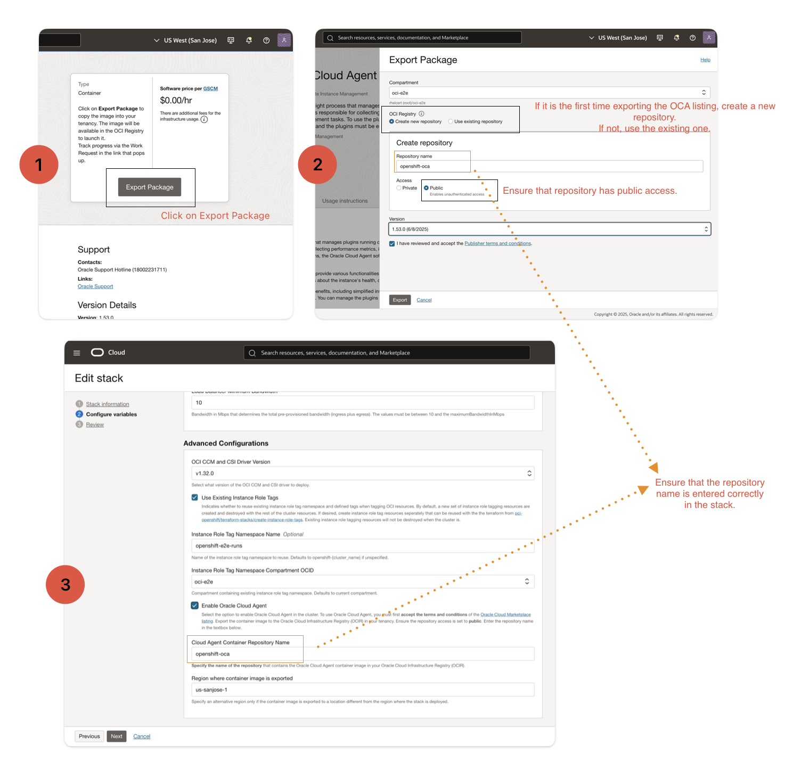

# Oracle Cloud Agent on OpenShift

[Oracle Cloud Agent](https://docs.oracle.com/en-us/iaas/Content/Compute/Tasks/manage-plugins.htm) is an agent running on a customer's launched instance that manages the lifecycle of useful plugins. One such plugin is instance-monitoring plugin which collects and transmits host metrics to OCI Monitoring Service, allowing customers to view these metrics in the OCI console. In addition to monitoring, OCA includes built-in plugins that support various use cases, such as Ultra High-Performance block storage, RDMA setup for GPU clusters, and more. Plugins are packaged based on the config that the dev team selects during the agent build time.

## Installation Instructions

### Prerequisites
Before installing Oracle Cloud Agent, ensure you have:
1. Accepted the terms and conditions of the [Oracle Cloud Marketplace listing](https://cloud.oracle.com/marketplace/application/ocid1.mktpublisting.oc1.phx.amaaaaaabg7vt6ia6vyockkduxg2jvwmxzef7nliwilshjavyjrybs66g57q).
2. Exported the marketplace container image to the Oracle Cloud Infrastructure Registry (OCIR) in your tenancy.
3. Set the repository access to **public**.

### Installation Steps
a. Enable Oracle Cloud Agent by checking the boolean checkbox:
   - `use_oracle_cloud_agent`: Enable Oracle Cloud Agent in the cluster.

b. Specify the Cloud Agent Container Repository Name:
   - `oracle_cloud_agent_repo_name`: Enter the name of the repository that contains the Oracle Cloud Agent container image in your OCIR. Default is "openshift-oca".

c. Specify the Region where the container image is exported:
   - `region`: Specify the region where the container image is exported. This is typically the same region where the stack is deployed.

### Instructions to update
To update Oracle Cloud Agent, follow these steps:

1. Export the Latest OCA Image: Export the latest Oracle Cloud Agent image from the Marketplace using the instructions provided earlier.
2. Copy the Pull Command: Copy the pull command for the container image from the exported Oracle Cloud Agent repository.
3. Update the Image URL: Replace the $OCA_IMAGE_URL in the custom_manifests/manifests/06-oci-oca.yml file with the pull command obtained in the previous step.
4. Apply the Manifest: Apply the updated manifest and verify that the agent pods are running successfully on the cluster.